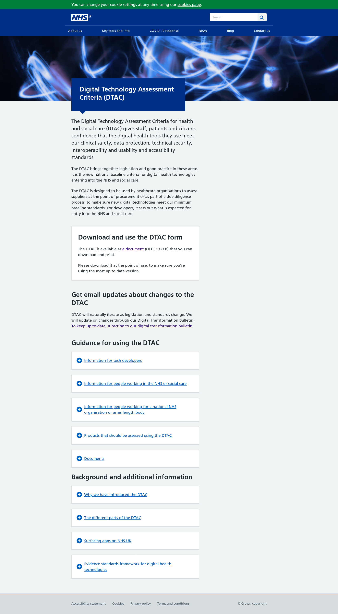

# Digital Technology Assessment Criteria (DTAC)

The [Digital Technology Assessment Criteria for health and social care (DTAC)](https://www.nhsx.nhs.uk/key-tools-and-info/digital-technology-assessment-criteria-dtac/) ([archive](https://web.archive.org/web/*/www.nhsx.nhs.uk/key-tools-and-info/digital-technology-assessment-criteria-dtac/)) gives staff, patients and citizens confidence that the digital health tools they use meet our clinical safety, data protection, technical security, interoperability and usability and accessibility standards.

