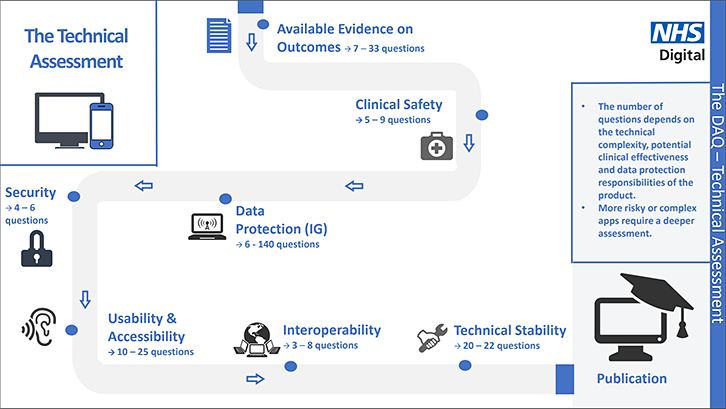

# How NHS Digital assess health apps and digital tools

NHS Digital ensure that all products published on the NHS Apps Library must meet a set of standards:

- make sure that all products do what they say they do.
- make sure that developers have taken all appropriate action to keep patients safe using their product.
- make sure that any personal information collected or shared, by an app or digital tool, is handled in a safe, fair and lawful way.
- ask for confirmation that a security assessment has been carried out against applicable Open Web Application Security Project standards.
- need to make sure that a person can understand and use an app or digital tool effectively.
- test how well a product exchanges data with other systems.
- understand how an app or digital tool has been tested and how testing will continue over time.

Source: [How we assess health apps and digital tools](https://digital.nhs.uk/services/nhs-apps-library/guidance-for-health-app-developers-commissioners-and-assessors/how-we-assess-health-apps-and-digital-tools)

## Assessment Process

Source: [How we assess health apps and digital tools](https://digital.nhs.uk/services/nhs-apps-library/guidance-for-health-app-developers-commissioners-and-assessors/how-we-assess-health-apps-and-digital-tools)

## Digital Assessment Questions

NHS Digital publish the Digital Assessment Questions (DAQs) used to assess health apps and digital tools for inclusion on the NHS Apps Library. Developers of apps and digital tools should review this document to better understand the standards for all products published on the Apps Library. This represents a full list of all possible questions, however not all questions will be relevant to all products. You can find out more about the assessment process here and check if your product is eligible. Any questions or comments relating to this document can be sent to daq.team@nhs.net.

Digital Assessment Questions: [online](https://digital.nhs.uk/services/nhs-apps-library/guidance-for-health-app-developers-commissioners-and-assessors/how-we-assess-health-apps-and-digital-tools#preview-the-questions) and [pdf](digital-assessment-questions/daq.pdf)

DAQs last updated: 17/05/19

The DAQ [roadmap](https://indd.adobe.com/view/51d857c0-00ee-4a2f-9b4b-02cb1c2a9ac7) for developers shows planned changes based on relevant national standards, policy and regulations for apps and digital tools in healthcare. [pdf](digital-assessment-questions/Apps_and_Wearables_Roadmap_v2.2.pdf)
